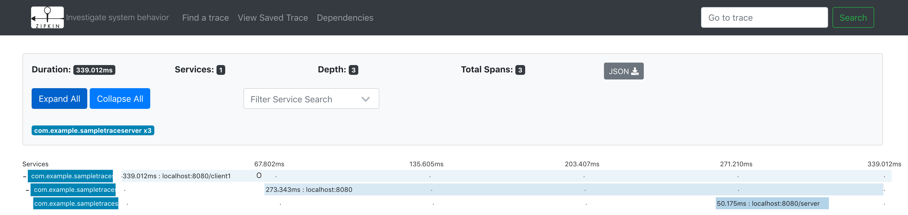
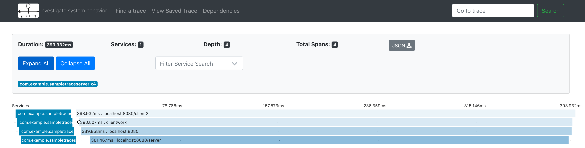

# Akka Http client tracing 
This project showcases an OpenTracing enabled sample application using Lightbend Telemetry (Cinnamon). This is a simple example of how to use Akka Http client tracing together with Lightbend Telemetry and is not intended to be used as an exclusive source of information. You can find more information about tracing here: [Lightbend Telemetry](https://developer.lightbend.com/docs/telemetry/current/extensions/opentracing.html). 

**Note that this project requires Lightbend subscription credentials to work. Contact Lightbend for information of how to get access.**

## Running Zipkin

Information for how to run Zipkin in Docker can be found [here](https://github.com/openzipkin/docker-zipkin#running).

## Running the sample

Open a terminal window and type:
> sbt run

In another terminal window type:
> curl localhost:8080/client1

or 
> curl localhost:8080/client2

See the code for more information about what the different endpoints do in terms of tracing (implicit or explicit).

## Zipkin UI

Open up the [Zipkin UI](http://localhost:9411) and click on "Find Traces" to see the available traces.

#### UI example 1 - client1 invocation:

#### UI example 2 - client2 invocation:

